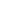

# Real Estate Price Prediction  (README.md in progress)
##### Justin Ong, 20th January 2025

### Skills:
`Python | NumPy | Pandas | Matplotlib | scikit-learn | HTML | CSS | JavaScript`

### Tools:
`Jupyter Notebook | VS Code | PyCharm | Flask | Postman`

##### [See my other projects!](https://github.com/aJustinOng)

---

## Overview

This project is based on CodeBasic's [Real Estate Price Prediction](https://www.youtube.com/playlist?list=PLeo1K3hjS3uu7clOTtwsp94PcHbzqpAdg) project.

In this data science project, I cleaned and visualized a real estate dataset from Kaggle and used it to build a model with scikit-learn using linear regression. Next, I created a Python Flask server that can use the model to run HTTP requests, which I tested using Postman. Lastly, I made a website using HTML, CSS, and JavaScript with a user-friendly UI, where the user can enter their desired house area (square feet), number of bedrooms and bathrooms, and state to get a predicted price.

The model building section covers a majority of data science concepts like data cleaning, outlier removal, feature engineering, dimensionality reduction, one hot encoding, and K-Fold cross-validation. This README.md is a complete documentation of the project.


## Table of contents:
1. [Importing Libraries and Data Loading](#1-importing-libraries-and-data-loading)
2. [Data Cleaning: Outlier Removal and Feature Engineering](#2-data-cleaning-outlier-removal-and-feature-engineering)
3. [One Hot Encoding Using Pandas](#3-one-hot-encoding-using-pandas)
4. [Model Building Using Scikit-Learn](#4-model-building-using-scikit-learn)
5. [Creating a Python Flask Server](#5-creating-a-python-flask-server)
6. [Creating a User-Friendly Website](#6-creating-a-user-friendly-website)
7. [Summary](#summary)

---

## 1. Importing Libraries and Data Loading

### 1.1 Dataset

I found a [kaggle dataset](https://www.kaggle.com/datasets/ahmedshahriarsakib/usa-real-estate-dataset) that contained 2.2M+ real estate listings in U.S. states (and territories) with suitable values we can use to train a prediction model, such as price, location, number of bedrooms, number of bathrooms, and area in square feet. The data was collected from Realtor, a popular real estate listing website in the United States. It is a CSV file with the following columns:

### realtor-data.csv (2,226,382 entries)
- brokered_by (categorically encoded agency/broker)
- status (housing status, either ready for sale or ready to build)
- price (housing price, either the current listing price or recently sold price)
- bed (number of bedrooms)
- bath (number of bathrooms)
- acre_lot (property/land size in acres)
- street (categorically encoded street address)
- city (city name)
- state (state name)
- zip_code (postal code of the area)
- house_size (house area/size/living space in square feet)
- prev_sold_date (last sold date)

### 1.2 Import Libraries

First, we need to import the necessary libraries and set certain matplotlib settings on a new Jupyter Notebook:

```
import pandas as pd  
import numpy as np  
from matplotlib import pyplot as plt  
%matplotlib inline  
import matplotlib  
matplotlib.rcParams['figure.figsize'] = (20, 10)
```

### 1.3 Load Dataset

We can read the dataset CSV file into the notebook using Pandas:

```
df1 = pd.read_csv('realtor-data.csv')
df1.head()
```


And validate the dataset size (2,226,382 rows, 12 columns):

```
df1.shape
```

### 1.4 Drop Unnecessary Columns

We need to remove the columns that are not necessary to train the model. To keep the project simple and manageable, we also drop values like `acre_lot` and limit the location column to state by dropping `street`, `city`, and `zip_code`. By only categorizing the locations by state, it helps the model training process by dimensionality reduction, especially during the one-hot encoding process (around 50 columns for each state instead of thousands or millions of values).

```
df2 = df1.drop(['brokered_by', 'status', 'prev_sold_date', 'acre_lot', 'street', 'city', 'zip_code'], axis = 'columns')
df2.head()
```


Notice that the new dataframe with dropped values into `df2`. The dataset was now ready for cleaning.

## 2. Data Cleaning: Outlier Removal and Feature Engineering

Most of the time in data science projects is spent on data cleaning, ensuring the our final model is presented with proper and suitable data.

### 2.1 Data Cleaning: NA Values

The first step in data cleaning is usually removing null and junk data, as well as removing duplicate data in the dataset. We can find the number of null values by using:

```
df2.isnull().sum()
```


Here we find a hefty amount of null values. Some prices were set to $0, which does not make sense, so we also remove them.

```
df3 = df2.dropna()
df3 = df3[df3['price'] != 0]
df3 = df3.drop_duplicates()
df3.shape
```

After removing the null values and duplicates, we see that the shape has been reduced to (1,430,967 rows, 5 columns).

> Another alternative to just removing the null values is to replace them with a median of the total dataset. However, since they took up more than a third of the dataset, I decided that it was safer to just remove them to avoid skewing the data.

### 2.2 Dimensionality Reduction

One mignt notice that the value `Puerto Rico` showed up in the `state` column when head() was displayed. This is because the dataset includes both U.S. states and territories. Since we only need U.S. states in this project, the non-states can be grouped into an `Other` category. We can do this by using a list of U.S. states (conveniently written by ChatGPT) to filter the rest into the `Other` category:

```
us_states = [
    'Alabama', 'Alaska', 'Arizona', 'Arkansas', 'California', 'Colorado', 'Connecticut', 'Delaware', 
    'Florida', 'Georgia', 'Hawaii', 'Idaho', 'Illinois', 'Indiana', 'Iowa', 'Kansas', 'Kentucky', 
    'Louisiana', 'Maine', 'Maryland', 'Massachusetts', 'Michigan', 'Minnesota', 'Mississippi', 
    'Missouri', 'Montana', 'Nebraska', 'Nevada', 'New Hampshire', 'New Jersey', 'New Mexico', 
    'New York', 'North Carolina', 'North Dakota', 'Ohio', 'Oklahoma', 'Oregon', 'Pennsylvania', 
    'Rhode Island', 'South Carolina', 'South Dakota', 'Tennessee', 'Texas', 'Utah', 'Vermont', 
    'Virginia', 'Washington', 'West Virginia', 'Wisconsin', 'Wyoming'
]

df3.state = df3.state.apply(lambda x: 'Other' if x not in us_states else x)
len(df3.state.unique())
```
Now the number of unique states is shown to be 51 (the 50 U.S. states + the Other category) which is our expected result.

### 2.3 Outlier Removal: Prices

To reduce the amount of price outliers, we can use this function (we will see an identical function for price per sqft) based on one standard deviation from the median. The dataset is split according to state (since it is one of the most predominant differences in prices) reduced from outliers, and then concatenated back together.

```
def remove_price_outliers(df):
    df_out = pd.DataFrame()
    for key, subdf in df.groupby('state'):
        m = np.median(subdf.price)
        st = np.std(subdf.price)
        reduced_df = subdf[(subdf.price>(m-st)) & (subdf.price<=(m+st))]
        df_out = pd.concat([df_out,reduced_df],ignore_index=True)
    return df_out
```

After running the function, the shape has been further reduced to (1,339,113 rows, 5 columns):

```
df4 = remove_price_outliers(df3)
df4.shape
```

### 2.4 Feature Engineering

Here we add a new feature called `price_per_sqft` which is just `price` divided by `house_size` or total sqft. This value will be used in cleaning the dataset further.

```
df4['price_per_sqft'] = df4['price']/df4['house_size']
df4.head()
```


### 2.5 Outlier Removal: Bedroom per Square Feet

Some rows contained a ridiculous number of bedrooms (we will address bathrooms later), the most having 444 bedrooms. Some of these are probably error values so I looked up the realistic average sqft per bedroom, which was 300sqft.

> I would consult this type of information from an expert if I was working on a real-life model for a company.

We can look at some of the outliers with `house_size` less than `300` per bedroom by using the following:

```
df4[df4.house_size/df4.bed<300].head()
```


And remove them, slightly reducing the shape to (1,321,719 rows, 6 columns):

```
df5 = df4[~(df4.house_size/df4.bed<300)]
df5.shape
```

### 2.6 Outlier Removal: Price Per Square Feet

Returning to our new value `price_per_sqft`, we want to check if there are outliers for that value.

```
df5.price_per_sqft.describe()
```


We can see that the `min` and `max` values are drastic extremes, at 0.000109 and 8714.29 respectively. We can use a similar function to the one we used for price outliers, which removes the outliers one std from the median for each state.

```
def remove_pps_outliers(df):
    df_out = pd.DataFrame()
    for key, subdf in df.groupby('state'):
        m = np.median(subdf.price_per_sqft)
        st = np.std(subdf.price_per_sqft)
        reduced_df = subdf[(subdf.price_per_sqft>(m-st)) & (subdf.price_per_sqft<=(m+st))]
        df_out = pd.concat([df_out,reduced_df],ignore_index=True)
    return df_out
```

Now the shape is reduced to (1,045,858 rows, 6 columns):

```
df6 = remove_pps_outliers(df5)
df6.shape
```

And the dataset looks better:

```
df6.price_per_sqft.describe()
```


### 2.7 Outlier Removal: Price Per Bedroom

To help the model make a more distinct prediction between the number of bedrooms, we can remove rows where there is a higher price even when there are less bedrooms. We can visualize the current situation between 2-bedroom houses and 3-bedroom houses using matplotlib's scatterplots:

```
def plot_scatter_chart(df, state):
    twoBed = df[(df.state == state) & (df.bed == 2)]
    threeBed = df[(df.state == state) & (df.bed == 3)]
    matplotlib.rcParams['figure.figsize'] = (15, 10)
    plt.scatter(twoBed.house_size, twoBed.price, color = 'blue', label = '2 bedrooms', s = 50)
    plt.scatter(threeBed.house_size, threeBed.price, marker = '+', color = 'green', label = '3 bedrooms', s = 50)
    plt.xlabel("Total Square Feet Area")
    plt.ylabel("Price Per Square Feet")
    plt.title(state)
    plt.legend()
    plt.show()
```

So after using the following function to remove said outlier, the shape is drastically reduced to (485,655 rows, 6 columns):

```
# Remove bedroom outliers (same state, but 2 bed price is higher than 3 bed, etc.)
def remove_bed_outliers_by_number(df):
    exclude_indices = np.array([])
    for state, state_df in df.groupby('state'):
        bed_stats = {}
        for bed, bed_df in state_df.groupby('bed'):
            bed_stats[bed] = {
                'mean': np.mean(bed_df.price_per_sqft),
                'std': np.std(bed_df.price_per_sqft),
                'count': bed_df.shape[0]
            }
        for bed, bed_df in state_df.groupby('bed'):
            stats = bed_stats.get(bed-1)
            if stats and stats['count']>5:
                exclude_indices = np.append(exclude_indices, bed_df[bed_df.price_per_sqft<(stats['mean'])].index.values)
    return df.drop(exclude_indices,axis='index')

df7 = remove_bed_outliers_by_number(df6)
df7.shape
```

And by using `plot_scatter_chart(df6, 'New York')` and `plot_scatter_chart(df7, 'New York')` we can see the differences for the state of New York:


Another example, for the state of Arkansas:


### 2.8 Outlier Removal: More Bathrooms than Bedrooms?

There was one more outlier we need to look at, which was the number of bathrooms. It is unlikely that a house would have 2 more bathrooms than bedrooms, so we consider those as outliers.

> Similar to the minimum sqft per bedroom outlier, I would consult this information from an expert if I was working on a real-life model for a company.

We can view those using:

```
df7[df7.bath>df7.bed+2]
```


And now the dataset is reduced to (483,553 rows, 6 columns) after removing those values:

```
df8 = df7[df7.bath<df7.bed+2]
df8.shape
```

### 2.9 Histogram of Price Per Square Feet

The `price_per_sqft` distribution looks much better now when we run:

```
df8.price_per_sqft.describe()
```


We can also plot a histogram of `price_per_sqft` of the current dataset. We can see that we now have a nice distribution across the dataset.

```
matplotlib.rcParams["figure.figsize"] = (20,10)
plt.hist(df8.price_per_sqft,rwidth=0.8)
plt.xlabel("Price Per Square Feet")
plt.ylabel("Count")
plt.show()
```


### 2.10 Remove Price Per Square Feet

We have now used the `price_per_sqft` to perform all necessary cleaning and no longer need it. We can drop it with:

```
df9 = df8.drop(['price_per_sqft'],axis='columns')
df9.head()
```


At this point we have a fully cleaned dataset and can move on to one final step before building the model.

## 3. One Hot Encoding Using Pandas

We cannot build a model using categorical values, so we can use the one-hot encoding method (aka dummy variables) to convert each state into a binary format. We do this with Pandas' built-in dummies function:

```
dummies = pd.get_dummies(df9.state)
dummies.head()
```


Then we concatenate the `dummies` dataframe to the main dataframe, while dropping the `Other` category. We can drop it since if every other dummy variable is `False`, we know that the only column that can be `True` is `Other`.

```
df10 = pd.concat([df9, dummies.drop('Other', axis='columns')], axis='columns')
df10.head()
```


Since we have the states as dummy variables, we can now drop the `state` column:

```
df11 = df10.drop('state', axis='columns')
df11.head()
```


And verify the shape of the dataframe, which is now (483,553 rows, 54 columns). The columns are now `price`, `bed`, `bath`, `house_size`, and the 50 states.

```
df11.shape
```

## 4. Model Building Using Scikit-Learn

We can finally begin building our linear regression model that can predict real estate prices based on the number of bedrooms, number of bathrooms, area in sqft, and state.

### 4.1 Build Linear Regression Model

The first step of the model building process is to split the dataframe into two sub-dataframes: `y`, the value we are trying to predict (prices), and `X`, the values we use to do the prediction (the rest of the data). We get `X` by simply dropping `price` from the cleaned dataframe.

```
X = df11.drop('price', axis='columns')
X.head()
```


And we get `y` by isolating `price` from the same dataframe:

```
y = df11.price
y.head()
```


Using `X` and `y`, we split them into train and test datasets in a 80:20 ratio using scikit-learn:

```
from sklearn.model_selection import train_test_split
X_train, X_test, y_train, y_test = train_test_split(X, y, test_size=0.2, random_state=10)
```

And build the linear regression model using scikit-learn:

```
from sklearn.linear_model import LinearRegression
lr_clf = LinearRegression()
lr_clf.fit(X_train, y_train)
lr_clf.score(X_test, y_test)
```

We get a test score of `0.80876207`, which is not too bad for a simple model like this.

### 4.2 Use K-Fold Cross-Validation on Linear Regression model

We can further use K-fold cross-validation to test our model. K-fold cross-validation splits the data in `k` subsets (or folds), and then performs training and testing on each subset, averaging the the score from each subset. We continue to use scikit-learn to do this:

```
from sklearn.model_selection import ShuffleSplit, cross_val_score

cv = ShuffleSplit(n_splits=5, test_size=0.2, random_state=0)

cross_val_score(LinearRegression(), X, y, cv=cv)
```

We get an array of scores `0.81316742`, `0.74627989`, `0.81752128`, `0.81101241`, and `0.7370295`. So our model has a score around 0.7-0.8, which is fairly accurate for a basic linear regression model.

### 4.3 Test Model on Properties

Now that the model is trained and test, we can try it out! Create a function that takes in `state`, `bed`, `bath`, and `sqft` parameters and outputs a predicted price value of a property.

```
def predict_price(state, bed, bath, sqft):    
    loc_index = np.where(X.columns==state)[0][0]

    x = np.zeros(len(X.columns))
    x[0] = bed
    x[1] = bath
    x[2] = sqft
    if loc_index >= 0:
        x[loc_index] = 1

    return lr_clf.predict([x])[0]
```

If we run `predict_price('Arkansas', 2, 2, 1000)` we get `63502.942380954366`.

If we run `predict_price('Arkansas', 3, 3, 1000)` we get `106350.11599686736`.

If we run `predict_price('New York', 2, 2, 1000)` we get `521071.2429128873`.

If we run `predict_price('New York', 3, 3, 1000)` we get `563918.4165288003`.

We expect a property in New York to have a much higher price than in Arkansas and more bedrooms/bathrooms to increase the price, so the model looks good!

### 4.4 Export the Model to Pickle File

To use the model in a server, we can export it as a pickle file. Import the `pickle` library and use it to write a pickle file.

```
import pickle
with open('usa_home_prices_model.pickle','wb') as f:
    pickle.dump(lr_clf,f)
```

### 4.5 Export the Column Data to a JSON File

We also need to export the `X` columns to a JSON file for future use. The columns in `X` are as such:

```
X.columns
```


Convert all of them to lowercase and export them:

```
import json
columns = {
    'data_columns' : [col.lower() for col in X.columns]
}
with open("columns.json","w") as f:
    f.write(json.dumps(columns))
```

## 5. Creating a Python Flask Server

## 6. Creating a User-Friendly Website

## Summary

[See my other projects!](https://github.com/aJustinOng)
